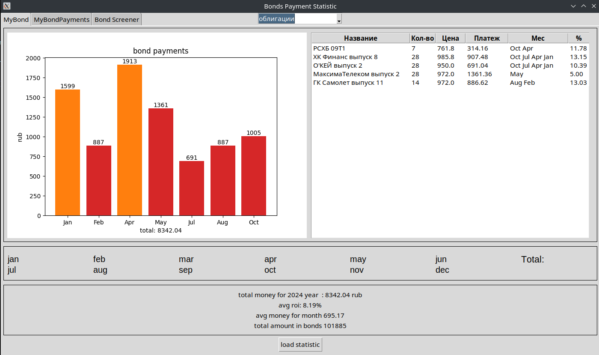

# Что это
Репозиторий содержит приложения для определения текущих показателей облигаций, доступных конкретному клиенту Тинькофф. Приложение агрегирует данные купленных облигаций из самого Тинькоффа, и выводит по ним статистику.

# Что понадобится
- Библиотеки python из requirements.txt;
- Личный кабинет в Тинькофф.Инвестиции;
- Интернет.

# Как пользоваться
1. Выпустить собственный токен в Тинькофф.Инвестиции: https://tinkoff.github.io/investAPI/token/ ;
2. Скачать репозиторий;
3. Добавить в config.json выпущенный токен и подкорректировать остальные параметры;

# Описание файлов в репозитории
- bonds_stats.py - главный скрипт;
- config.json - файл конфигурации, который содержит следующие поля:
	- TOKEN - персонализированный токен, выпустить и почитать о котором можно здесь: https://tinkoff.github.io/investAPI/token/ ;
	- API_DELAY - задержка в секунда между запросами. Тинькофф ограничивает в 100-300 запросов в минуту, соответственно этот параметр в пределах 0.2 - 0.5;

- requirements.txt - набор дополнительных библиотек для установки перед запуском;

